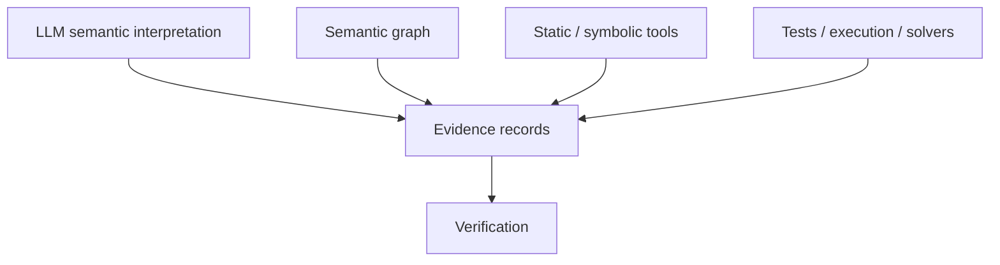

# Neurosymbolic Code Auditing — Architectural Integration Notes for the Semantic Graph Engine

## Status

Research review incorporated into G3.0 semantic graph analysis design.

## Source

Chengpeng Wang, Zhuo Zhang, Xiangzhe Xu, Mingwei Zheng, Guannan Wei, and Xiangyu Zhang, **Neurosymbolic Code Auditing** (2026 survey manuscript supplied to the project).

The supplied manuscript has incomplete publication metadata on its title page, so this document treats it as a research manuscript rather than asserting a finalized venue or DOI.

---

## 1. Central thesis adopted by the repository

The most useful idea for this repository is that auditing is not a single prediction or a single static-analysis pass. It is an **iterative evidence-seeking workflow**.

The manuscript separates the workflow into:

1. an environment of code and non-code artifacts;
2. retrieval tools that acquire relevant context;
3. primitive tools that derive semantic properties;
4. auditing tools that generate candidate reports;
5. working and long-term memory that preserve intermediate evidence and reusable knowledge;
6. verification that determines whether a candidate conclusion deserves stronger epistemic status.

This supports the repository's existing architectural rule:

> Observation is not judgment.

A graph edge, dependency path, analyzer warning, LLM explanation, or retrieved document is evidence. It becomes an audit finding only after an explicit evaluation or verification step.


---

## 2. Observation, verification, and memory as the three architectural bottlenecks

The manuscript's strongest synthesis is the recurring trio:

- **Observation** — what the auditor can recover from code, documentation, configuration, project history, and tool outputs.
- **Verification** — what can be confirmed strongly enough to justify triage, remediation, or regression guards.
- **Memory** — what facts, assumptions, evidence, and prior work can be retained and reused safely across files, commits, and audit tasks.

These are adopted as orthogonal concerns rather than one monolithic `audit()` operation.

### Repository mapping

| Manuscript concept | Repository concept |
| --- | --- |
| Observation | `SemanticObservation` |
| Primitive fact | semantic edge / `EvidenceRecord` |
| Working memory | `AuditWorkingMemory` |
| Verification strength | `VerificationStatus` |
| Reusable audit artifact | `semantic_graph_analysis/v1` |
| Change invalidation | graph content fingerprint |
| Final audit judgment | deferred semantic-rule / verification layer |

---

## 3. Multimodal audit environment

The manuscript emphasizes that source code alone is insufficient for many real-world audits. Relevant semantic information may be distributed across:

- source code;
- API/library documentation;
- issue reports;
- commit and patch history;
- RFCs and design documents;
- configuration and deployment artifacts;
- community or usage discussions;
- static-analysis results;
- executable tests and witnesses.

The graph engine should therefore remain domain-independent and artifact-independent. It must be possible to represent software structure, scientific claims, documents, provenance records, and verification artifacts without redefining the graph core.

This supports keeping `SemanticNode.entity_type` and `SemanticEdge.relation_type` open rather than introducing a closed repository-wide ontology prematurely.

---

## 4. Retrieval is an architectural capability, not a preprocessing detail

The manuscript distinguishes retrieval from reasoning. Retrieval includes definition lookup, call-graph navigation, use-site analysis, structural/text search, version-control history, documentation lookup, and external context acquisition.

For this repository, retrieval results should eventually become explicit provenance-bearing artifacts. An auditing agent should be able to answer:

- What context was retrieved?
- Why was it retrieved?
- Which source/version did it come from?
- Which observations depend on it?
- Has that source changed since the observation was produced?

G3.0 does not yet implement retrieval orchestration, but analysis artifacts are designed so retrieved evidence can be incorporated later without redesigning result identity or provenance.

---

## 5. Primitive analysis hierarchy

The manuscript organizes code-oriented primitive analysis by semantic granularity:

```text
Expression level
    pointer / alias properties

Statement level
    data and control dependencies

Function level
    caller-callee relationships

Program level
    invariants and execution traces
```

This is particularly useful for the semantic graph engine because it prevents one generic notion of "dependency" from swallowing distinct semantics.

### G3 implication

The current dependency analysis intentionally handles only **typed graph reachability**. Future primitive analyzers should remain explicit, for example:

- `PointerObservation`
- `DataDependencyObservation`
- `ControlDependencyObservation`
- `CallRelationshipObservation`
- `InvariantCandidate`
- `ExecutionTraceCandidate`

These should not be collapsed into a generic `RELATED_TO` edge.

---

## 6. LLMs should augment symbolic analysis, not replace it

The survey repeatedly cautions against using LLMs as standalone replacements for dedicated analyzers. The useful division of labor is:

- LLMs interpret local semantics, informal specifications, names, documentation, patches, examples, and project-specific intent.
- symbolic/static tools provide scalable structure, over-approximation, path/data-flow machinery, and stronger validation.
- solvers, tests, fuzzing, concrete execution, or isolated reproduction can provide stronger evidentiary status for selected obligations.

This maps directly to the repository's desired architecture:



No source is automatically authoritative merely because it is generated by an LLM or by a static analyzer.

---

## 7. Manual-audit simulation vs semi-automatic auditing

The manuscript distinguishes two broad implementation strategies.

### Manual-audit simulation

LLMs perform focused semantic reasoning over bounded contexts assembled using retrieval, slicing, data-flow analysis, or symbolic techniques.

Representative surveyed patterns include staged data-flow workflows such as:

```text
source/sink identification
        -> function summaries
        -> candidate paths
        -> path validation
```

### Semi-automatic auditing

Existing analyzers remain the large-scale engine while LLMs assist with:

- specification/rule synthesis;
- analyzer configuration;
- detector customization;
- report interpretation;
- false-positive triage;
- remediation suggestions.

For this repository, both approaches can share the same semantic graph and evidence model. They differ in which tool generates an observation and which verifier assigns its status.

---

## 8. Path plausibility is not path feasibility

This is one of the most important rules adopted for G3.

A path discovered in the semantic graph means:

> the represented graph contains a path under the selected edge semantics.

It does **not** mean:

> this program execution path is feasible at runtime.

Future verification may use:

- SMT/solver checks;
- symbolic execution;
- static over-approximation;
- LLM/reasoning-model assessment when formal encoding is impractical;
- concrete tests or executable witnesses.

G3.0 therefore emits path evidence with status `observed`; it does not call that evidence `validated`.

---

## 9. Working memory and long-term memory

The manuscript's memory distinction is directly useful.

### Working memory

Task-specific state:

- intermediate semantic facts;
- candidate paths;
- provisional hypotheses;
- tool outputs;
- source/sink candidates;
- path conditions;
- alias information;
- validation attempts.

G3.0 implements a minimal `AuditWorkingMemory` for reusable analysis results.

### Long-term memory

Cross-task/project knowledge:

- API specifications;
- validated bug patterns;
- domain rules;
- reusable reasoning strategies;
- previously validated summaries.

Long-term memory is deliberately deferred because persistence introduces additional requirements around trust, invalidation, privacy, scope, and semantic drift.

---

## 10. Durable audit artifacts and lifecycle

A major recommendation of the manuscript is to compile model-derived reasoning into reusable artifacts rather than leaving it trapped in prompts or transcripts.

Examples include:

- analyzer rules;
- function summaries;
- inferred effects;
- source/sink specifications;
- path constraints;
- test harnesses;
- validated slices;
- provenance records.

The artifact must have a lifecycle. It should state:

1. what it claims;
2. what evidence supports it;
3. which graph/repository state it applies to;
4. how strongly it was verified;
5. when it must be rechecked.

G3.0 implements this principle through versioned JSON analysis artifacts, deterministic graph fingerprints, deterministic analysis IDs, and stale-result detection.

---

## 11. Cost-aware verification

The survey frames practical auditing as a budgeted decision process. Not every candidate path can receive the most expensive validation.

A mature audit orchestrator should eventually choose among actions based on:

- expected information gain;
- risk/severity;
- uncertainty;
- computational cost;
- prior evidence;
- availability of build/runtime environments.

A plausible future sequence is:

```text
cheap graph/static observation
        -> semantic filtering
        -> targeted static analysis
        -> solver/path check
        -> isolated executable reproduction
        -> human review for residual uncertainty
```

G3.0 does not implement budget allocation, but the explicit verification status and evidence records make that future orchestration possible.

---

## 12. Evidence-grounded remediation

The manuscript argues that auditing should support triage, repair, and regression prevention rather than stop at warning generation.

A credible repair should be traceable to:

- the suspected root cause;
- a feasible or validated path;
- the violated specification;
- the relevant configuration/environment;
- a validation envelope describing what was and was not checked.

The repository should therefore avoid an architecture in which an LLM-generated patch is accepted merely because it removes a warning. Future repair proposals should consume the same evidence graph used by detection.

---

## 13. Auditor security

Once an audit agent reads code, documents, issues, tool output, or web content, the auditor itself becomes part of the threat model.

The manuscript highlights adversarial comments, misleading names, poisoned documentation, retrieval traps, and provenance tampering.

The corresponding repository rule is:

> Project artifacts are evidence, not instructions to the auditor.

Future audit-agent execution should isolate policy/instructions from analyzed content and should execute builds, tests, and generated harnesses in controlled environments. Provenance is required so a human can reconstruct the evidence path.

---

## 14. Evaluation criteria adopted for future milestones

Precision/recall alone are inadequate for repository-scale auditing. Future evaluation should include:

- context required;
- evidence quality;
- verification strength;
- time to first actionable evidence;
- verification cost;
- stability under repository changes;
- marginal value of additional compute/budget;
- resistance to adversarial artifacts;
- ability to reproduce or invalidate prior findings.

This is especially important for an autonomous repository, where a result that cannot survive change or be reconstructed is not sufficient merely because it was once plausible.

---

## 15. G3.0 design decisions adopted from this review

The current implementation therefore adopts the following requirements:

1. Analysis outputs are **observations**, not findings.
2. Every emitted observation references explicit evidence.
3. Evidence carries provenance from the source semantic edge.
4. Current graph-only evidence defaults to `observed`, never `validated`.
5. Analysis results are tied to deterministic graph fingerprints.
6. Repeated analysis of the same graph/query is reproducible.
7. Working memory can identify results invalidated by graph changes.
8. Path analysis explicitly represents graph-path existence, not runtime feasibility.
9. Dependency relation scope is explicit and conservative.
10. Analysis/query layers cannot import computational graph backends directly.
11. Reusable analysis output is versioned and serializable.
12. Audit findings and remediation remain outside the G3 primitive-analysis layer.

---

## 16. Deferred roadmap derived from the review

### G3.1 — Verification layer

- rule evaluation;
- corroboration policies;
- static-analyzer validation adapters;
- solver/test/execution verification receipts;
- evidence promotion from `observed` to `corroborated` / `validated`.

### G3.2 — Audit memory lifecycle

- durable working-memory snapshots;
- long-term specification/pattern store;
- dependency-based invalidation;
- semantic-drift detection;
- versioned provenance lineage.

### G3.3 — Cost-aware orchestration

- verification budgets;
- risk/uncertainty prioritization;
- information-gain policies;
- staged escalation to expensive tools.

### G3.4 — Code auditing rules

- architectural dependency rules;
- data-flow / trust-boundary rules;
- code-generation change impact;
- LLM-generated code audit trails.

### G3.5 — Scientific/document auditing

Reuse the same observation–evidence–verification architecture for:

- scientific propositions;
- evidence eligibility;
- citation/support relationships;
- equations and assumptions;
- semantic consistency of generated publication content.

---

## Final integration principle

The objective is not to build a graph engine that merely traverses edges, nor an LLM that merely produces warnings.

The objective is an auditing stack that turns heterogeneous repository state into **durable, traceable, incrementally verifiable knowledge**.
